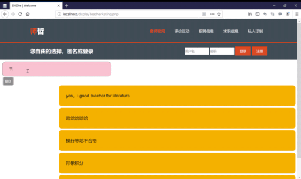

## I created this website during an internship that can be useful for evaluating the quality of education system in China.

#### This project uses Javascript to construct the UI. PHP as server side language. The database is based on MySQL. 

#### Feature list: 
 - Post activity and highlights from the teaching community
 - Post Job offering for teachers
 - Rate and review ratings of teachers from different schools. 

## Demo:
#### Search suggestion: 

 
#### Add comments to the database: 

 